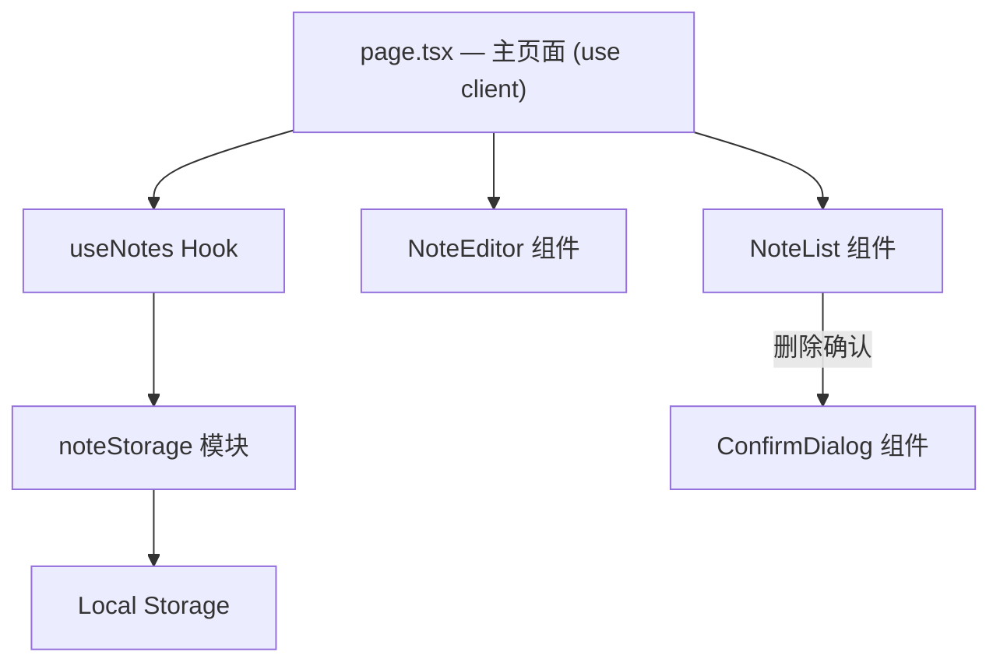
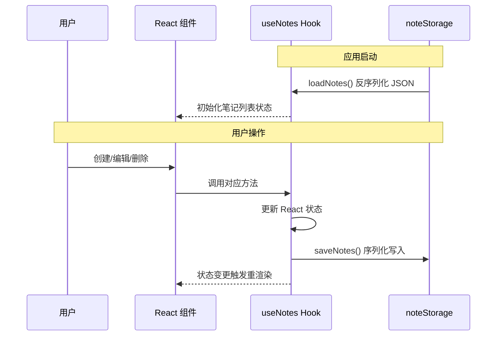

# 技术设计文档：Notepad App

## 概述

Notepad App 是一个基于 Next.js v16（App Router）的单页记事本应用。用户可以在浏览器中创建、编辑、删除笔记，所有数据通过 JSON 序列化存储在 Local Storage 中，无需后端服务。

应用采用左右分栏布局（窄屏时上下堆叠），左侧为笔记列表，右侧为笔记编辑器。核心数据流为：用户操作 → React 状态更新 → Local Storage 同步。

### 关键设计决策

| 决策 | 选择 | 理由 |
|------|------|------|
| 框架 | Next.js v16 (App Router) | 用户指定技术栈，SPA 模式运行 |
| 状态管理 | React useState + 自定义 Hook | 应用简单，无需引入外部状态库 |
| 持久化 | Local Storage + JSON | 用户指定，无后端依赖 |
| ID 生成 | crypto.randomUUID() | 浏览器原生支持，无需额外依赖 |
| 样式方案 | CSS Modules | Next.js 内置支持，组件级样式隔离 |
| 语言 | TypeScript | 类型安全，用户指定 |

## 架构

### 整体架构

应用采用分层架构，将 UI 组件、业务逻辑（Hook）和数据持久化分离：



所有组件均为 Client Components（文件顶部添加 `'use client'`），因为所有交互都在客户端完成。

### 数据流



## 组件与接口

### 文件结构

```
app/
  layout.tsx              # 根布局
  page.tsx                # 主页面（'use client'），组合所有组件
  page.module.css         # 主页面样式（分栏布局）
  components/
    NoteList.tsx          # 笔记列表组件
    NoteList.module.css
    NoteEditor.tsx        # 笔记编辑器组件
    NoteEditor.module.css
    ConfirmDialog.tsx     # 确认删除对话框
    ConfirmDialog.module.css
  lib/
    types.ts              # 类型定义
    noteStorage.ts        # Local Storage 读写模块
    useNotes.ts           # 笔记状态管理 Hook
```

### 组件接口

#### NoteList

```typescript
interface NoteListProps {
  notes: Note[];
  selectedNoteId: string | null;
  onSelectNote: (id: string) => void;
  onDeleteNote: (id: string) => void;
  onCreateNote: () => void;
}
```

- 展示笔记列表（标题 + 最后修改时间）
- 按最后修改时间降序排列（排序由 Hook 完成）
- 列表为空时显示"暂无笔记"提示
- 提供"新建笔记"按钮和每条笔记的删除按钮

#### NoteEditor

```typescript
interface NoteEditorProps {
  note: Note | null;
  onUpdateNote: (id: string, title: string, content: string) => void;
}
```

- 显示并编辑选中笔记的标题和内容
- 无选中笔记时显示占位提示（如"选择或创建一条笔记"）
- 输入变化时调用 onUpdateNote 保存

#### ConfirmDialog

```typescript
interface ConfirmDialogProps {
  isOpen: boolean;
  message: string;
  onConfirm: () => void;
  onCancel: () => void;
}
```

- 模态确认对话框，用于删除确认
- isOpen 为 false 时不渲染

#### useNotes Hook

```typescript
interface UseNotesReturn {
  notes: Note[];                // 按 updatedAt 降序排列
  selectedNoteId: string | null;
  selectedNote: Note | null;
  createNote: () => void;
  updateNote: (id: string, title: string, content: string) => void;
  deleteNote: (id: string) => void;
  selectNote: (id: string) => void;
}
```

- 启动时调用 `loadNotes()` 初始化状态
- 每次 notes 变更后调用 `saveNotes()` 同步到 Local Storage
- `createNote`: 生成 UUID、设置空标题/内容、记录时间戳，自动选中新笔记
- `updateNote`: 更新标题/内容，刷新 updatedAt 时间戳
- `deleteNote`: 移除笔记，若删除的是当前选中笔记则清空选中状态
- `selectNote`: 设置 selectedNoteId

#### noteStorage 模块

```typescript
const STORAGE_KEY = 'notepad-app-notes';

function saveNotes(notes: Note[]): void;
function loadNotes(): Note[];
```

- `saveNotes`: 将笔记数组 JSON.stringify 后写入 `localStorage.setItem`
- `loadNotes`: 从 `localStorage.getItem` 读取并 JSON.parse，数据无效时返回空数组并 `console.error` 记录错误

## 数据模型

### Note 类型

```typescript
interface Note {
  id: string;          // UUID，由 crypto.randomUUID() 生成
  title: string;       // 笔记标题
  content: string;     // 笔记内容
  createdAt: string;   // 创建时间，ISO 8601 格式
  updatedAt: string;   // 最后修改时间，ISO 8601 格式
}
```

### Local Storage 存储格式

键名：`notepad-app-notes`

值为 JSON 数组：

```json
[
  {
    "id": "550e8400-e29b-41d4-a716-446655440000",
    "title": "我的第一条笔记",
    "content": "这是笔记内容...",
    "createdAt": "2024-01-15T10:30:00.000Z",
    "updatedAt": "2024-01-15T11:00:00.000Z"
  }
]
```

## 正确性属性（Correctness Properties）

*属性（Property）是指在系统所有有效执行中都应成立的特征或行为——本质上是对系统应做什么的形式化陈述。属性是人类可读规格说明与机器可验证正确性保证之间的桥梁。*

### Property 1: 创建笔记的结构不变量

*For any* 笔记列表，调用 createNote 后，列表长度应增加 1，且新创建的笔记应具有：非空的唯一 UUID、空字符串的 title、空字符串的 content、有效的 ISO 8601 格式 createdAt 和 updatedAt 时间戳。

**Validates: Requirements 1.1, 1.2, 1.3**

### Property 2: 编辑笔记的持久化与时间戳更新

*For any* 已存在的笔记和任意有效的新标题/新内容，调用 updateNote 后，该笔记在存储中的 title 和 content 应等于新值，且 updatedAt 应大于或等于更新前的 updatedAt。

**Validates: Requirements 2.1, 2.2**

### Property 3: 选择笔记加载正确数据

*For any* 笔记列表中的笔记，调用 selectNote 后，selectedNote 应返回与该笔记 id 对应的完整 Note 对象（title、content、时间戳均一致）。

**Validates: Requirements 2.3**

### Property 4: 删除笔记从列表中移除

*For any* 包含至少一条笔记的列表，删除其中一条笔记后，列表长度应减少 1，且列表中不应再包含该笔记的 id。边界情况：若被删除的笔记是当前选中笔记，则 selectedNoteId 应变为 null。

**Validates: Requirements 3.2, 3.3**

### Property 5: 笔记列表按修改时间降序排列

*For any* 包含多条笔记的列表，notes 数组中每个元素的 updatedAt 应大于或等于其后续元素的 updatedAt。

**Validates: Requirements 4.2**

### Property 6: 序列化往返一致性

*For any* 有效的 Note 数组，调用 saveNotes 后再调用 loadNotes，应返回与原始数组深度相等的 Note 数组（所有字段值一致）。

**Validates: Requirements 5.1, 5.2, 5.3**

### Property 7: 无效数据的优雅降级

*For any* 非法 JSON 字符串或不符合 Note[] 结构的数据写入 Local Storage 后，调用 loadNotes 应返回空数组且不抛出异常。

**Validates: Requirements 5.4**

## 错误处理

### Local Storage 错误

| 场景 | 处理方式 |
|------|----------|
| 数据格式无效（非 JSON） | `loadNotes` 返回空数组，`console.error` 记录错误 |
| 数据结构不符合 Note[] | `loadNotes` 返回空数组，`console.error` 记录错误 |
| Local Storage 不可用（隐私模式等） | `saveNotes` 静默失败并 `console.error`，应用仍可在内存中正常使用 |
| 存储空间已满 | `saveNotes` 捕获 QuotaExceededError，`console.error` 记录错误 |

### 数据验证

`loadNotes` 在反序列化后应验证数据结构：
- 检查解析结果是否为数组
- 检查每个元素是否包含必需字段（id, title, content, createdAt, updatedAt）
- 检查字段类型是否为 string
- 任何验证失败则返回空数组

### UI 边界情况

| 场景 | 处理方式 |
|------|----------|
| 无选中笔记时 NoteEditor | 显示占位提示文字 |
| 笔记列表为空 | 显示"暂无笔记"提示 |
| 删除当前选中笔记 | 清空 selectedNoteId，NoteEditor 回到占位状态 |

## 测试策略

### 测试方法

采用双轨测试策略：单元测试 + 属性测试（Property-Based Testing），两者互补。

- **单元测试**：验证具体示例、边界情况和错误条件
- **属性测试**：验证在所有有效输入上成立的通用属性

### 属性测试库

使用 [fast-check](https://github.com/dubzzz/fast-check) 作为 TypeScript 属性测试库，配合 Vitest 运行。

### 属性测试配置

- 每个属性测试至少运行 100 次迭代
- 每个属性测试必须以注释引用设计文档中的属性编号
- 标签格式：`Feature: notepad-app, Property {number}: {property_text}`
- 每个正确性属性由一个属性测试实现

### 测试范围

#### 属性测试（Property Tests）

| 测试 | 对应属性 | 测试目标 |
|------|----------|----------|
| 创建笔记结构验证 | Property 1 | 生成随机笔记列表，创建新笔记，验证结构不变量 |
| 编辑持久化与时间戳 | Property 2 | 生成随机笔记和随机标题/内容，验证更新后的持久化和时间戳 |
| 选择笔记数据一致性 | Property 3 | 生成随机笔记列表，随机选择一条，验证返回数据一致 |
| 删除笔记移除验证 | Property 4 | 生成随机笔记列表，随机删除一条，验证列表变化和选中状态 |
| 列表排序不变量 | Property 5 | 生成随机时间戳的笔记列表，验证排序正确性 |
| 序列化往返 | Property 6 | 生成随机 Note 数组，saveNotes 后 loadNotes，验证等价性 |
| 无效数据降级 | Property 7 | 生成随机非法字符串，写入 localStorage，验证 loadNotes 返回空数组 |

#### 单元测试（Unit Tests）

| 测试 | 对应需求 | 测试目标 |
|------|----------|----------|
| 空列表显示提示 | 4.3 | 笔记列表为空时渲染"暂无笔记" |
| 删除确认对话框 | 3.1 | 点击删除按钮弹出确认对话框 |
| 删除当前选中笔记清空编辑器 | 3.3 | 删除选中笔记后编辑器回到占位状态 |
| localStorage 不可用时不崩溃 | 5.4 | 模拟 localStorage 不可用，应用正常运行 |

### 测试文件结构

```
__tests__/
  noteStorage.test.ts       # noteStorage 模块的单元测试和属性测试
  useNotes.test.ts           # useNotes Hook 的单元测试和属性测试
  components/
    NoteList.test.tsx        # NoteList 组件单元测试
    NoteEditor.test.tsx      # NoteEditor 组件单元测试
    ConfirmDialog.test.tsx   # ConfirmDialog 组件单元测试
```
